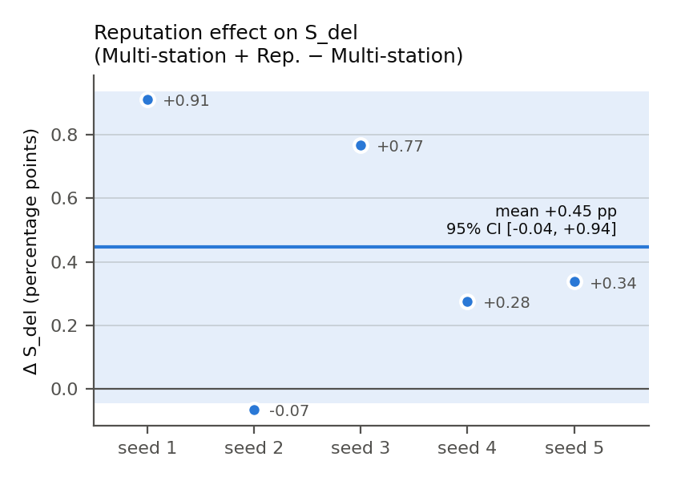
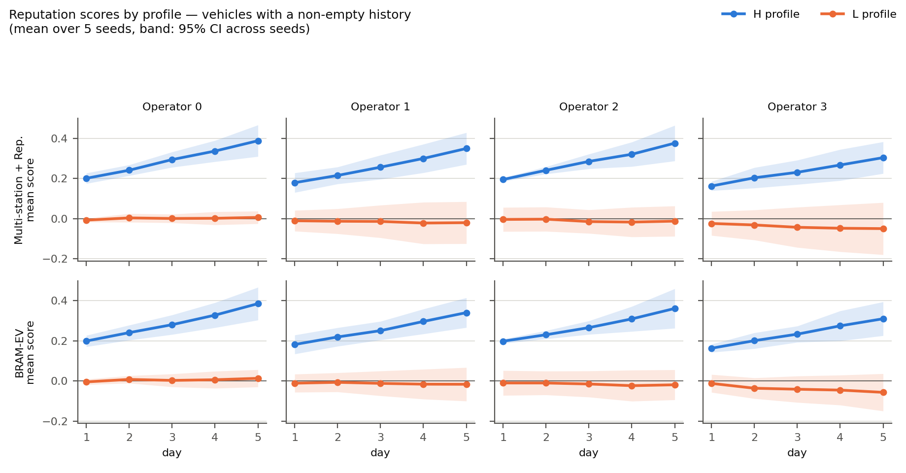

# Pilote bimodal — analyse des résultats

Pilote exploratoire : 5 graines, 250 véhicules, 40 stations à 2 points de
recharge, 4 opérateurs, 4 méthodes. La population compte 125 conducteurs H
(présence 0,90) et 125 conducteurs L (présence 0,30). Le run est propre
(`git_dirty: false`, commit `c8a95ba`) et tous les contrôles passent. La
configuration, les définitions et les contrôles sont détaillés dans
`README.md` ; les données en pleine précision sont dans `bimodal/`.

## En bref

Dans une population très hétérogène, **les scores de réputation distinguent
bien les bons et les mauvais conducteurs, mais cette information ne se
traduit presque pas en meilleur service**. L'effet de la réputation reste
positif mais petit.
L'adaptation n'apporte rien : Load-aware, fait mieux que
BRAM-EV.

## 1. La réputation améliore-t-elle le service ?

Faiblement, sans que ce soit établi.

| Critère | Effet de la réputation | IC à 95 % | Graines positives | p ajustée (Holm) |
|---|---|---|---|---|
| S_del | +0,45 point | [−0,04 ; +0,94] | 4 sur 5 | 0,13 |
| S_full | +1,35 point | [+0,34 ; +2,35] | 4 sur 5 | 0,061 |
| E_tot | +0,05 MWh | [−0,19 ; +0,28] | 3 sur 5 | 0,62 |

L'effet est la différence Multi-station + Rep. − Multi-station, calculée
graine par graine. La correction de Holm porte sur les trois critères.

- **S_full :** c'est le signal le plus net. L'intervalle exclut zéro point
  par point, mais l'effet ne passe pas la correction de Holm à 5 %.
- **Comparé à la campagne principale :** l'effet est plus marqué ici
  (+0,45 point sur S_del, contre des effets de −0,056 à +0,117 point dans la
  campagne principale). L'hétérogénéité aide donc un peu, mais l'énergie
  totale délivrée ne bouge pas : on sert un peu mieux certaines requêtes,
  sans délivrer plus d'énergie au total.
- **Adaptation** (BRAM-EV − Multi-station + Rep.) : aucun effet. Les signes
  changent d'une graine à l'autre, et les trois p ajustées valent 1.

## 2. Les scores distinguent-ils les profils ?

Oui, clairement.

- Dans chaque opérateur, l'écart de score moyen H − L passe d'environ 0,19
  le premier jour à environ 0,37 le cinquième.
- Un score H tiré au hasard dépasse un score L dans 79 à 88 % des cas.
- La séparation progresse au fil des jours, à mesure que les historiques se
  remplissent : pour H, 34 % des couples véhicule–opérateur ont un
  historique le jour 1, 84 % le jour 5.

L'information comportementale est donc bien présente dans les historiques.
Le problème n'est pas la capacité des scores à identifier les profils. Un
écart de score reste un historique d'événements signé, pas une probabilité
de présence calibrée.

## 3. Pourquoi une bonne séparation change si peu l'allocation

C'est le résultat le plus intéressant du pilote.

- **Les scores des conducteurs L restent proches de zéro** (entre −0,06 et
  +0,01 en moyenne), c'est-à-dire **la même valeur qu'un véhicule sans
  historique**.
- **La cause est la forme des barèmes.** Après normalisation, une présence
  vaut +1 et une absence −0,75. Pour un conducteur L, présent 30 % du temps
  et absent 35 %, ces deux effets se compensent presque : la valeur attendue
  d'un événement vaut −0,02, contre +0,85 pour un conducteur H.
- **Les stations ne peuvent donc pas pénaliser les conducteurs peu
  fiables.** Avec réputation, elles font même un peu plus d'offres aux L
  (89,2 %) qu'aux H (87,8 %), avec la même part de durée offerte (environ
  70 %). La réputation fait seulement progresser le taux d'offre aux H (de
  85,0 % à 87,8 %).
- **L'écart de service entre profils vient du comportement des conducteurs,
  pas de l'allocation.** S_del vaut environ 77 % pour H et 25 % pour L,
  quelle que soit la méthode.

En résumé, la réputation **récompense les bons conducteurs mais ne dissuade
pas les mauvais**, et c'est surtout dissuader les mauvais qui libérerait de
la capacité.

## 4. La règle de sélection des offres compte davantage

Load-aware fait mieux que BRAM-EV, et la différence penche dans le même
sens pour presque toutes les graines :

| Critère | BRAM-EV − Load-aware | IC à 95 % | Graines où Load-aware fait mieux |
|---|---|---|---|
| S_del | −1,25 point | [−2,07 ; −0,43] | 5 sur 5 |
| S_full | −3,32 points | [−4,70 ; −1,94] | 5 sur 5 |
| E_tot | −0,42 MWh | [−0,82 ; −0,03] | 4 sur 5 |

Cette comparaison est descriptive (sans correction de Holm).

- Load-aware a aussi un délai programmé plus court : BRAM-EV attend 5,9
  minutes de plus.
- Sa charge est moins concentrée : la station la plus occupée est à 91 % de
  ses créneaux, contre 96 % avec BRAM-EV.

Comme dans la campagne principale, **choisir la station la moins chargée
pèse plus que tenir compte de la réputation**.

## 5. Ce que cela implique pour le papier

- **Ce que l'on peut affirmer :**
  - dans la population bimodale évaluée, les scores identifient les
    profils ;
  - l'apport de la réputation au service reste faible et n'est pas établi
    après correction ;
  - l'adaptation n'apporte rien ;
  - la règle de sélection des offres reste le facteur dominant.
- **Le mécanisme des barèmes** est une explication précise et vérifiable de
  la faiblesse de l'effet. Il répond en partie à la question ouverte du
  papier (« score informativeness and reputation-induced allocation changes
  remain unmeasured ») : l'information existe, mais les barèmes empêchent
  qu'elle pénalise les conducteurs peu fiables.
- **Ce que l'on ne peut pas affirmer :** que l'hétérogénéité explique à elle
  seule l'écart avec les anciens résultats. Il faudrait pour cela le même
  plan sous le régime équilibré (2 points de recharge, mêmes 5 graines).

## 6. Limites et pistes

- **Pilote exploratoire :** 5 graines, un régime, une capacité. Une absence
  de significativité ne prouve pas une équivalence.
- **Horizon :** cinq jours. Les historiques sont encore incomplets au début.
- **Deux pistes, par ordre de priorité :**
  1. **Contrôle sous le régime équilibré**, avec la même capacité et les
     mêmes graines (20 simulations), pour isoler l'effet de l'hétérogénéité.
  2. **Barèmes qui pénalisent davantage l'absence**, pour que les scores L
     deviennent négatifs. C'est le test direct du mécanisme identifié, mais
     il ajoute un régime, ce que le cadrage du pilote voulait éviter.
